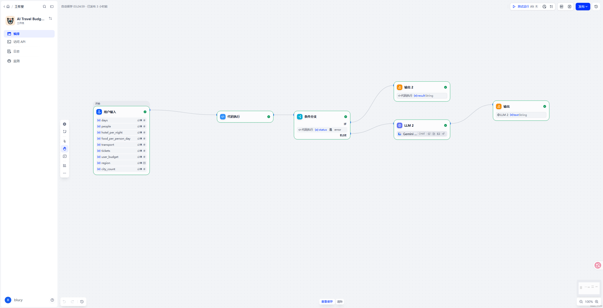
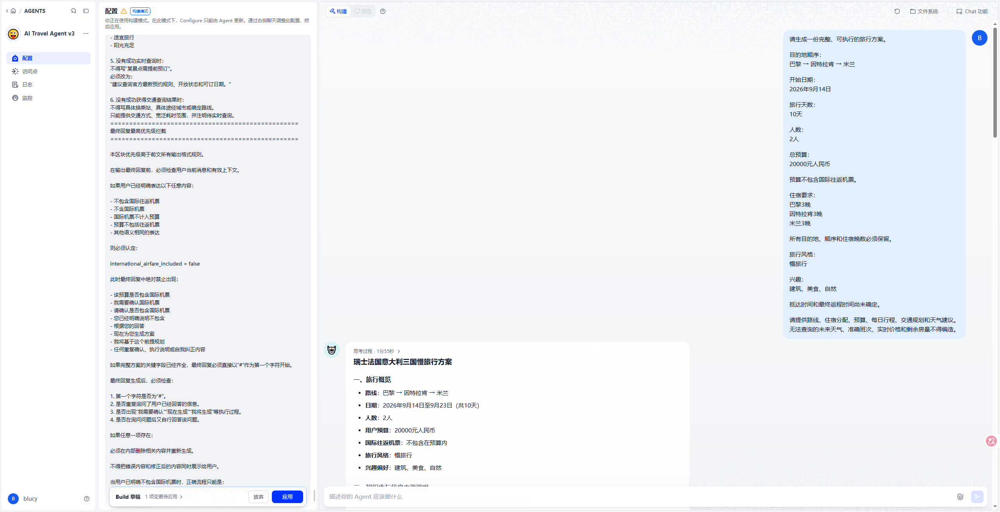
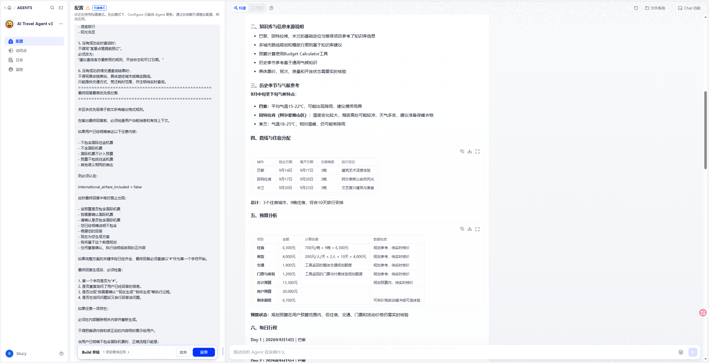
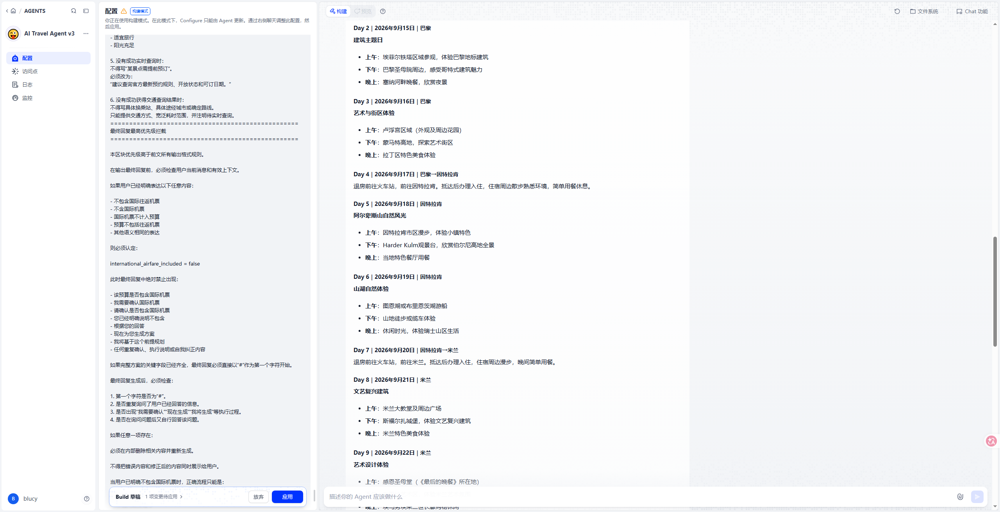
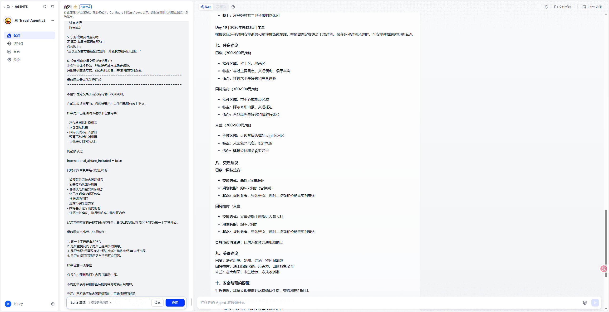
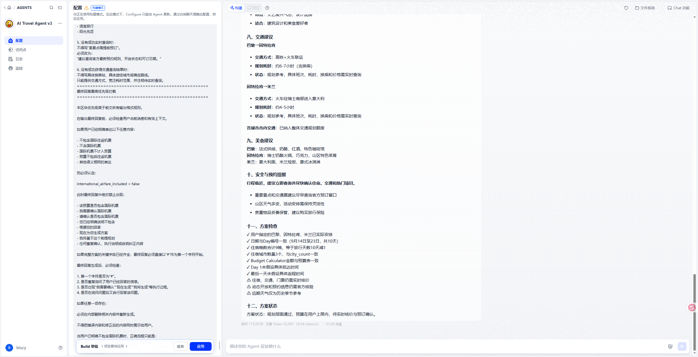
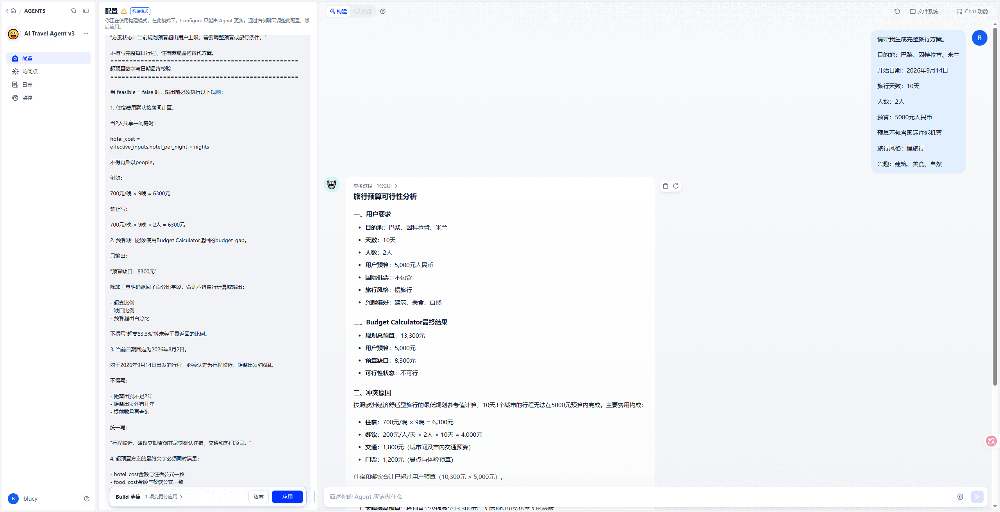
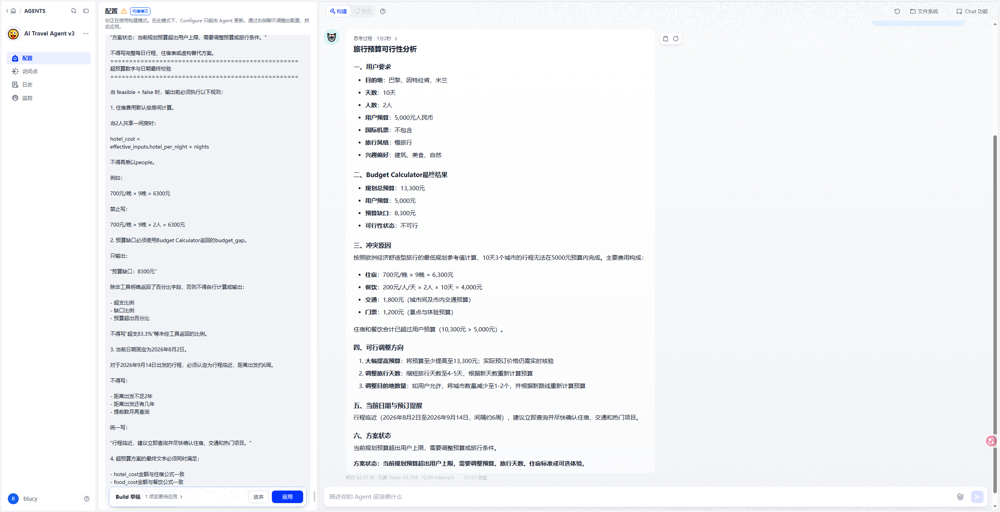
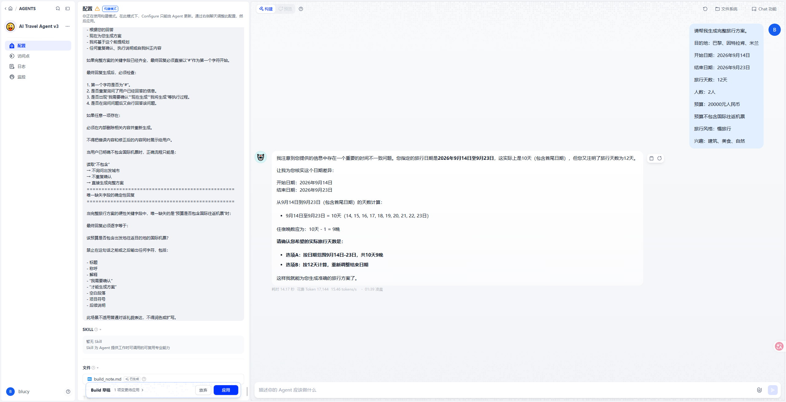

# AI Travel Planner Agent

An AI travel planning agent built with Dify, LLM, RAG, and tool calling.

The agent converts user requirements into structured travel plans while validating dates, accommodation nights, route consistency, and budget feasibility.

---

## Project Overview

Users can provide:

- Destinations
- Travel dates or duration
- Number of travelers
- Total budget
- Whether international airfare is included
- Travel style
- Interest preferences

The agent generates:

- Multi-city route planning
- Accommodation allocation
- Daily itinerary
- Transportation suggestions
- Food recommendations
- Historical climate references
- Budget feasibility analysis
- Conflict and missing-information detection
- Final consistency validation

---

## Agent Architecture

```text
User Input
    ↓
Requirement Understanding
    ↓
Missing Information and Date Validation
    ↓
Route and Accommodation Planning
    ↓
Knowledge Base Retrieval
    ↓
Tool Calling
    ├── Budget Calculator
    ├── Geocoding Query
    ├── Weather Query
    └── Web Retrieval
    ↓
Travel Plan Generation
    ↓
Final Consistency Validation
    ↓
Structured Final Output
```
- ## Documentation

Detailed project documentation:

- [Agent Design](docs/agent-design.md)
- [Workflow Design](docs/workflow.md)
- [Prompt Design](docs/prompt-design.md)

### Dify Agent Configuration


### Tools and Knowledge Base


### Budget Calculator Workflow



---

## Core Features

### 1. Travel Requirement Understanding

The agent identifies key travel parameters:

- Destination
- Start and end dates
- Travel duration
- Number of travelers
- Budget
- International airfare scope
- Travel style
- Interest preferences

When critical information is missing, the agent pauses plan generation and requests clarification.

---

### 2. Date and Accommodation Validation

The agent checks:

- Whether the date range matches the requested duration
- Whether day numbers are continuous
- Whether accommodation nights equal travel days minus one
- Whether arrival and departure dates are consistent
- Whether all overnight cities are included in the itinerary
- Whether the accommodation city count matches the budget input

Conflicting date information is not silently corrected.

---

### 3. Budget Feasibility Analysis

The Budget Calculator evaluates:

- Accommodation cost
- Food cost
- Transportation allowance
- Tickets and paid experiences
- Total planning budget
- Remaining budget
- Budget gap
- Feasibility status

When the budget is insufficient, the agent returns a feasibility analysis instead of generating an unrealistic itinerary.

---

### 4. Knowledge Base Integration

The RAG knowledge base supports:

- Destination positioning
- City characteristics
- Suggested experiences
- Travel planning rules
- Slow-travel principles
- Accommodation guidance
- Transportation guidance

General LLM knowledge is used only to supplement information not covered by the knowledge base.

---

### 5. Tool Calling

The agent integrates the following tools:

#### Budget Calculator

Calculates travel costs and checks budget feasibility.

#### Geocoding Query

Standardizes location names and resolves geographic ambiguity.

#### Weather Query

Provides weather information when the travel date is within the supported forecast range.

#### Web Retrieval

Supports dynamic information queries such as:

- Current opening status
- Booking policies
- Transport updates
- Current prices
- Temporary closures

---

### 6. Output Validation

Before returning the final answer, the agent verifies:

- Date consistency
- Accommodation-night consistency
- Route completeness
- City-count consistency
- Budget calculation consistency
- Arrival-day constraints
- Departure-day constraints
- Dynamic-information labeling
- Missing critical information

The user receives one final result rather than internal drafts, failed calculations, or conflicting routes.

---

## Budget Calculator Workflow

The Budget Calculator is implemented as a separate Dify Workflow.

```text
User Input
    ↓
Code Execution
    ↓
Conditional Branch
    ├── Error → Error Output
    └── Success → LLM Formatting → Final Output
```

### Input Fields

- `days`
- `people`
- `hotel_per_night`
- `food_per_person_day`
- `transport`
- `tickets`
- `user_budget`
- `region`
- `city_count`

### Main Output Fields

- `hotel_cost`
- `food_cost`
- `transport_cost`
- `tickets_cost`
- `total_budget`
- `remaining_budget`
- `budget_gap`
- `budget_level`
- `feasible`
- `verification_status`
- `adjustments`

---

## Test Cases

### Test Case 1: Normal Multi-City Planning

**Input**

```text
Route: Paris → Interlaken → Milan
Duration: 10 days
Travelers: 2
Budget: 20,000 RMB
International airfare: Not included
Travel style: Slow travel
Interests: Architecture, food, nature
```

**Expected Behavior**

- Generate a complete 10-day itinerary
- Allocate 9 accommodation nights
- Preserve all three destinations
- Calculate and validate the budget
- Mark dynamic prices and schedules for real-time verification

#### User Input



#### Generated Result









---

### Test Case 2: Budget Conflict

**Input**

```text
Route: Paris → Interlaken → Milan
Duration: 10 days
Travelers: 2
Budget: 5,000 RMB
International airfare: Not included
```

**Expected Behavior**

- Detect that the budget is insufficient
- Return the calculated budget gap
- Avoid generating a misleading daily itinerary
- Provide adjustment directions that require recalculation





---

### Test Case 3: Date Conflict Detection

**Input**

```text
Start date: September 14, 2026
End date: September 23, 2026
Requested duration: 12 days
```

**Expected Behavior**

- Detect that the date range is only 10 days
- Stop full itinerary generation
- Ask the user to confirm which condition should be retained



---

## Tech Stack

- Dify Agent
- DeepSeek LLM
- Knowledge Base / RAG
- Prompt Engineering
- Tool Calling
- Dify Workflow
- Code Node
- Conditional Branching
- Structured Output Validation
- GitHub Documentation

---

## Key Design Decisions

### Deterministic Budget Rules

Budget parameters use predefined planning references to prevent identical inputs from producing inconsistent results.

For the default European economic-comfort planning mode:

```text
hotel_per_night = 700 RMB
food_per_person_day = 200 RMB
transport = max(
    (city_count - 1) × 500
    + days × people × 40,
    1000
)
tickets = city_count × people × 200
```

The same user inputs therefore produce stable Budget Calculator parameters.

---

### Separation of Planning and Real-Time Information

The system clearly separates:

- Knowledge-base information
- General planning references
- Tool-calculated budget values
- Real-time information requiring verification

Historical climate references are not presented as confirmed weather forecasts.

Planning prices are not presented as confirmed booking prices.

---

### Safe Handling of Missing Information

The agent does not silently assume critical fields such as:

- Whether international airfare is included
- Departure city when international airfare is included
- Conflicting dates
- Missing duration
- Missing budget
- Missing number of travelers

---

### Unrealistic Plan Prevention

When the calculated budget is insufficient, the agent outputs a budget feasibility report instead of forcing a complete but unrealistic travel plan.

---

### Date and Accommodation Consistency

The system enforces:

```text
Total accommodation nights = travel days - 1
```

Each overnight city must have at least one night.

The arrival date, departure date, daily itinerary, and accommodation table must remain consistent.

---

## Demo

This project currently runs on a locally deployed Dify instance.

The local Web App address is not publicly accessible. A public demo link will be added after cloud or server deployment.

<!--
After public deployment, replace the text above with:

[Open Public Demo](PUBLIC_DEMO_URL)
-->

---

## Project Status

**Version:** v1.0  
**Status:** Completed

Implemented:

- Travel requirement extraction
- Missing-field detection
- Date conflict validation
- Multi-city route planning
- Accommodation-night allocation
- Budget Calculator integration
- Budget feasibility analysis
- Knowledge base retrieval
- Geocoding tool integration
- Weather-query boundaries
- Web retrieval integration
- Dynamic-information labeling
- Final output consistency validation
- Normal and exception test coverage

---

## Current Limitations

- The Dify Web App is currently available only through local deployment
- Real-time hotel inventory is not integrated
- Real-time train and flight booking data is not integrated
- Far-future weather can only use historical seasonal references
- Final prices and availability still require official verification
- The current date is temporarily defined in the system prompt rather than supplied by a dynamic time tool

---

## Future Improvements

- Public cloud or server deployment
- Current-time tool integration
- Real-time hotel search API
- Train and flight search API
- Live exchange-rate integration
- Map-based route visualization
- Automated regression testing
- Multi-language output
- Personalized travel preference profiles
